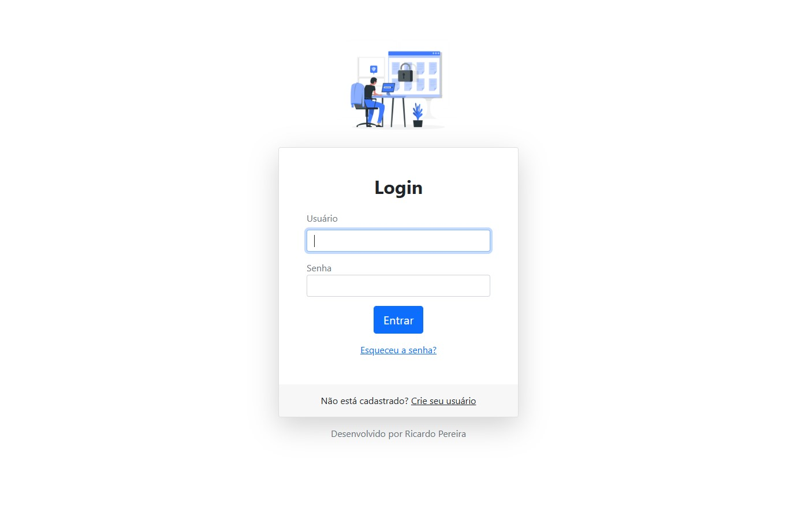
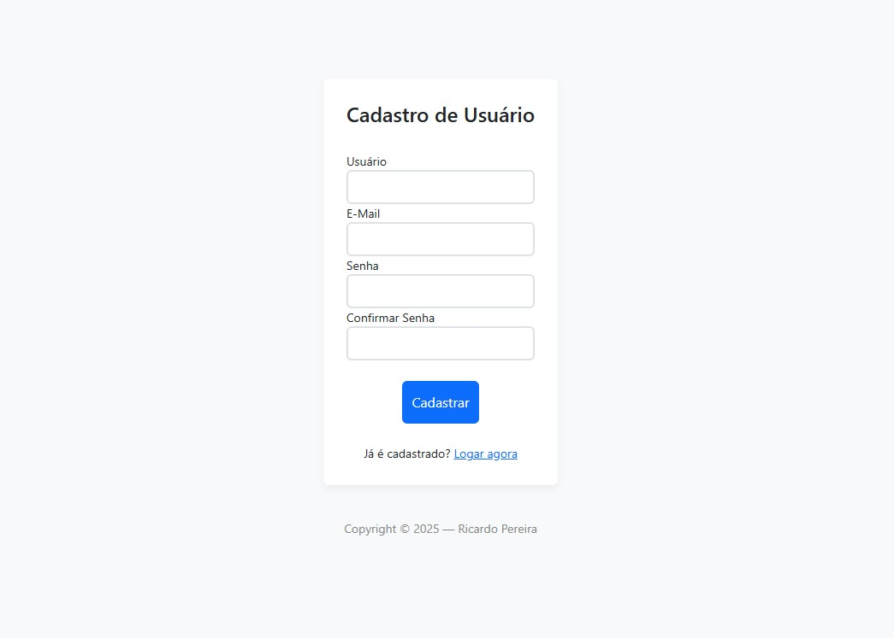
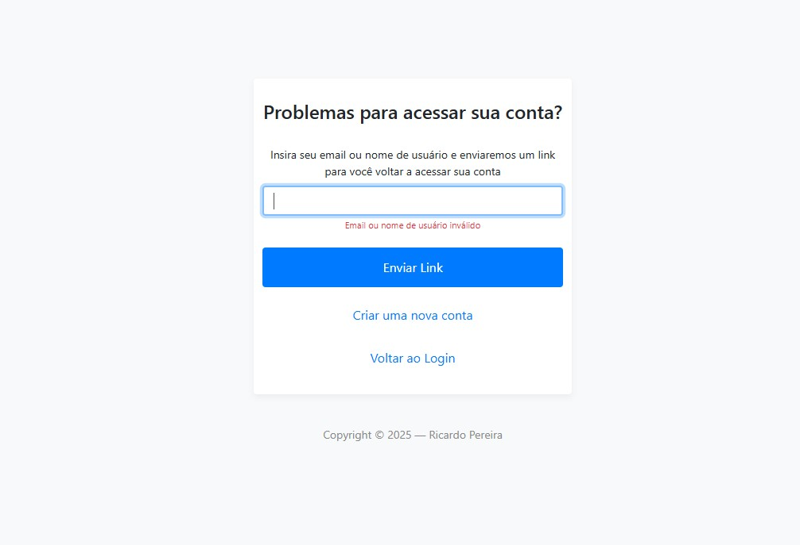
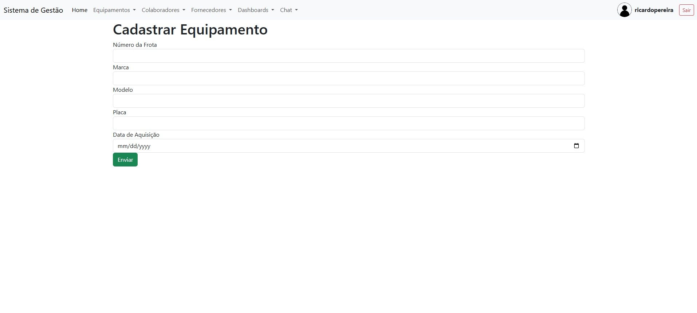
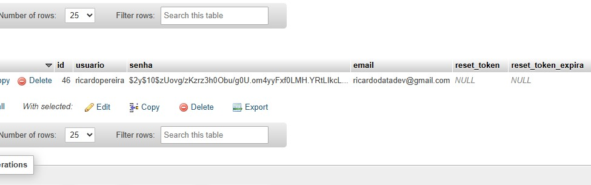

## Projeto: Sistema de Cadastro 

O sistema conta com uma área de login segura, onde o usuário pode se cadastrar, acessar sua conta ou recuperar a senha caso a tenha esquecido. O processo de recuperação de senha é realizado via e-mail automático, garantindo praticidade e segurança.

Todas as senhas são armazenadas utilizando hash criptográfico, seguindo boas práticas de proteção de dados e autenticação.

Após o login, o usuário tem acesso à página de gerenciamento, onde é possível cadastrar novos equipamentos, veículos e colaboradores, além de visualizar, editar e excluir registros existentes.

O sistema implementa as operações completas de CRUD (Criar, Ler, Atualizar e Deletar), oferecendo uma interface simples, responsiva e fácil de usar, que permite o controle e a organização das frotas e equipamentos de forma eficiente e prática.

